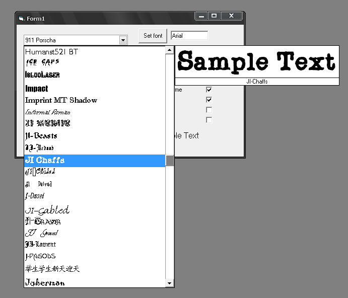



## Font Combo Ocx \(Last Release\)

### Description

the issue on "drop-down list remains on screen even if i click somewhere else on form" is now fixed without adding any "setfocus" line on the form. an auto-complete as been added too (without textbox) when the control is drop-down just tap the font you want to find on the keyboard. It's usefull for a fast search!

Now you can add multiples combos on same form,you can also apply XP look !!!

This is a complete FontCombo control with manys features like: Preview with custom text,recent list with build-in load-save,currently used fonts and manys customizable features...
 
### More Info
 

             |
---                |---
**Submitted On**   |2008-04-15 13:11:42
**By**             |[Christian Coutu](https://github.com/Planet-Source-Code/PSCIndex/blob/master/ByAuthor/christian-coutu.md)
**Level**          |Intermediate
**User Rating**    |4.7 (28 globes from 6 users)
**Compatibility**  |VB 6\.0
**Category**       |[Custom Controls/ Forms/  Menus](https://github.com/Planet-Source-Code/PSCIndex/blob/master/ByCategory/custom-controls-forms-menus__1-4.md)
**World**          |[Visual Basic](https://github.com/Planet-Source-Code/PSCIndex/blob/master/ByWorld/visual-basic.md)
**Archive File**   |[Font\_Combo2109744152008\.zip](https://github.com/Planet-Source-Code/christian-coutu-font-combo-ocx-last-release__1-70355/archive/master.zip)

